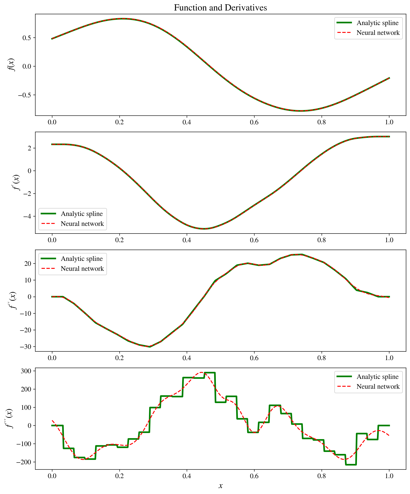
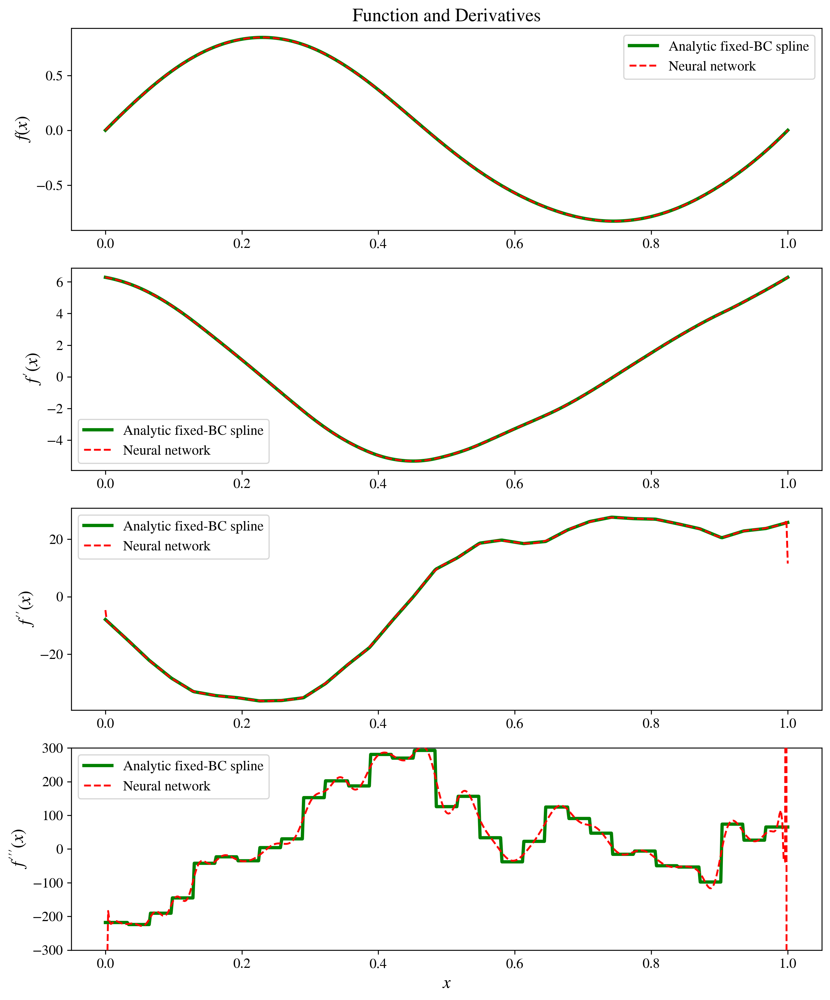

# RKHS and Deep Learning
An intuitive derivation of smoothing splines from variational calculus, demonstrating their relationship to reproducing kernel Hilbert spaces (RKHS) and regularized neural networks.

[Read the writeup](./rkhs-and-deep-learning-notes.pdf)

## Contents

- Introduction to variational calculus
- Green’s-function derivation of smoothing splines
- Reproducing kernel Hilbert spaces formalism
- Comparison with regularized neural networks
- Connection to Noether's theorem

## Numerical comparison

We compare analytic smoothing-spline solutions with regularized neural networks under two boundary setups:

- **Free endpoints:** no boundary conditions are imposed on the neural network.
- **Fixed endpoints:** \(f(0)=f(1)=0\) and \(f'(0)=f'(1)=2\pi\), matching the target function.

The corresponding functions and their first three derivatives are shown below.

### Free endpoints

Generated by [`spline_vs_nn_natural_BCs.py`](code/spline_vs_nn_natural_BCs.py).

### Fixed endpoints

Generated by [`spline_vs_nn_fixed_BCs.py`](code/spline_vs_nn_fixed_BCs.py).
