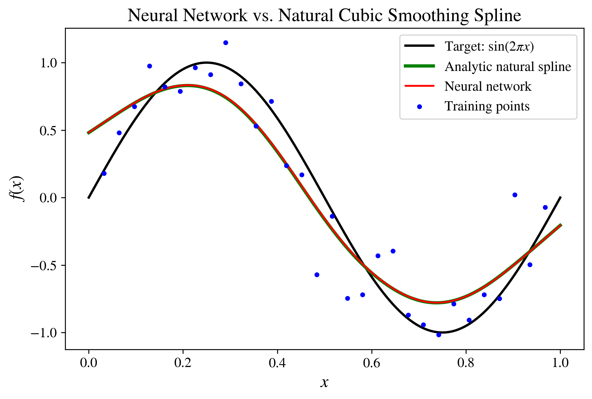
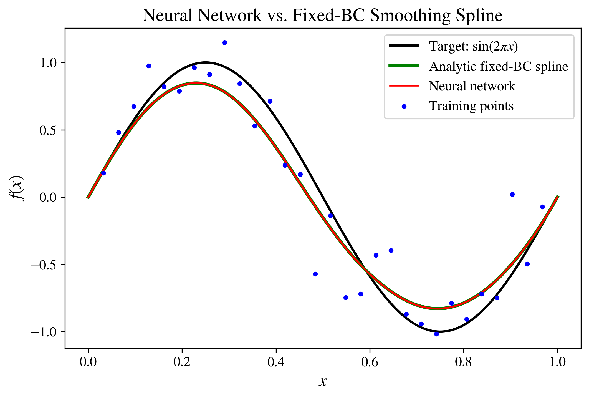
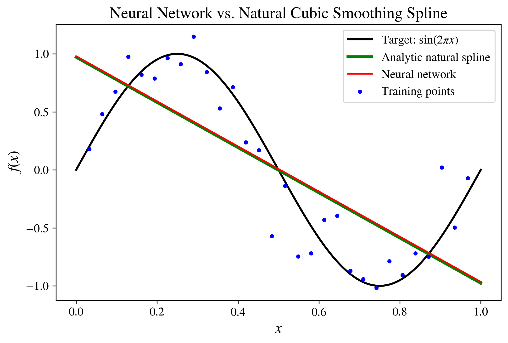
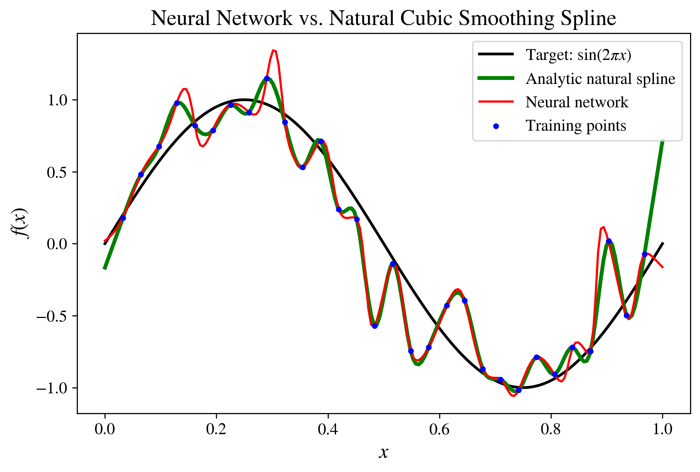

# RKHS and Deep Learning
An intuitive derivation of smoothing splines from variational calculus, demonstrating their relationship to reproducing kernel Hilbert spaces (RKHS) and regularized neural networks.

[Read the writeup](./rkhs-and-deep-learning-notes.pdf)

## Contents

- Introduction to variational calculus
- Green’s-function derivation of smoothing splines
- Reproducing kernel Hilbert spaces formalism
- Comparison with regularized neural networks
- Connection to Noether's theorem

## Numerical comparison

The dataset was generated from

$$
f_{\mathrm{true}}(x)=\sin(2\pi x),
\qquad x\in[0,1],
$$

using \(N=30\) datapoints with additive Gaussian noise. Unless otherwise stated, we used a regularization strength of $\lambda=10^{-4}$.

The neural network was a fully connected tanh network with three hidden layers of width \(64\),

$$
1\rightarrow64\rightarrow64\rightarrow64\rightarrow1,
$$

and was trained using Adam for 20,000 epochs with learning rate $10^{-3}$.

We considered two boundary setups. For the free-endpoint model, no explicit boundary conditions were imposed on the neural network. For the fixed-endpoint model, we imposed

$$
f(0)=f(1)=0,
\qquad
f'(0)=f'(1)=2\pi,
$$

matching the endpoint values of the target function.

  
  

These figures show excellent agreement between the regularized neural-network and analytic smoothing-spline solutions. The corresponding derivative comparisons are available for the
[free-endpoint model](figures/spline_vs_nn_derivatives_natural_BCs.png)
and [fixed-endpoint model](figures/spline_vs_nn_derivatives_fixed_BCs.png).

To illustrate the effect of the regularization strength, we also compare the free-endpoint solutions in the limits $\lambda=100$ and $\lambda=0$.

  
  

The figures are generated by
[`spline_vs_nn_natural_BCs.py`](code/spline_vs_nn_natural_BCs.py)
and [`spline_vs_nn_fixed_BCs.py`](code/spline_vs_nn_fixed_BCs.py).
